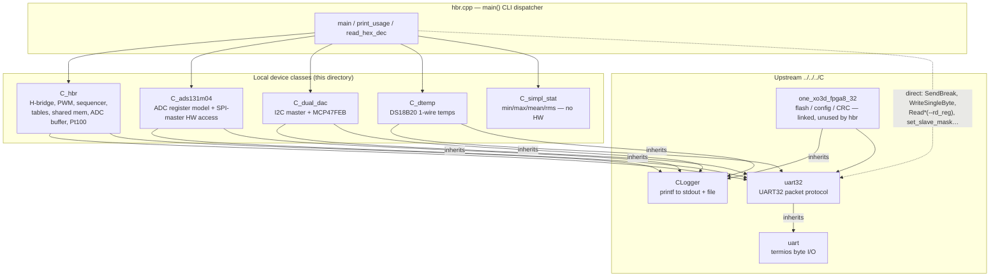

# N219 4x H-Bridge — host software code map

Covers the host-side C++ in `host/` and the upstream communication code it
links from `upstream/` (`uart`, `uart32`, `CLogger`, `one_xo3d_fpga8_32`).
Both came from the Heidelberg SVN tree `Lattice_XO2_UART` (see
`worklog/00-repository-setup.md`). Written as the reference for porting the
code to a NOMAD driver and controller.

Line references are `file:line` in the tree as of 2026-09-22.

---

## 1. System picture

```
 Linux host (RP4 / PC / WSL)                         N219 PCB, Lattice MachXO3D-9400 FPGA
 ┌───────────────────────────────┐   UART 4 Mbit/s   ┌──────────────────────────────────────────────┐
 │ hbr  (CLI, one process per    │  /dev/ttyACM0     │ UART32 slave (board ID 1)                    │
 │       invocation)             │  (USB-CDC) or     │   └─ 24-bit address / 32-bit data bus         │
 │   C_hbr  C_ads131m04          │  /dev/ttyUSB0     │       ├─ config/CSR      0x0100              │
 │   C_dual_dac  C_dtemp         │  (optical)        │       ├─ ADS131M04 SPI master 0x0400 ─► 2 ADCs│
 │   C_simpl_stat                │◄─────────────────►│       ├─ I2C master      0x0480 ─► MCP47FEB  │
 │        │                      │                   │       ├─ 1-wire DS18B20  0x0490 ─► 2 sensors │
 │        ▼                      │                   │       ├─ small shared mem 0x0800 (SW32 CPU)  │
 │   uart32  (protocol)          │                   │       ├─ H-bridge block  0x2000 ─► 2 channels│
 │   uart    (termios, bytes)    │                   │       ├─ SW32 IMEM       0x4000              │
 └───────────────────────────────┘                   │       └─ ADC capture buf 0x6000              │
                                                      └──────────────────────────────────────────────┘
```

* **Two motor channels** (ch 0 / ch 1): each is an H-bridge chip driven by
  an FPGA PWM generator and sequencer (`SRC/SHUTTER/hbr_*.vhd`). The
  sequencer plays a table of *(state, duration, power)* entries from a RAM
  when triggered by "go ON" or "go OFF" (open or close the shutter). The
  trigger can come from software (`ADDR_START_ON_OFF`) or from external control
  inputs (AFBR / OCPL, NIM trigger).
* **Two ADS131M04 ADCs** (8 channels) measure voltage, current, and the
  proportional current output and Pt100 for each bridge. While a sequence runs,
  the FPGA writes the samples into the capture buffer.
* **MCP47FEB dual DAC** over I2C sets the VREF pin of each H-bridge chip.
  VREF sets the chip's current limit.
* **DS18B20 1-wire sensors** sit on the top and bottom of the H-bridge.
  **Pt100** readings are placed in the small shared memory by the SW32 soft CPU.

---

## 2. Layering and dependencies



**Key fact for porting:** each device class holds only a `uart32*`, and all of
its hardware access goes through that pointer. The public `uart32` methods
used anywhere in this project are:

| uart32 method | used by |
|---|---|
| `WriteByte / WriteWord / Write3Bytes / WriteDWord` | `C_hbr::WriteReg`, `C_dual_dac::WriteReg`, `C_ads131m04` (direct), `C_dtemp` (direct) |
| `ReadByte / ReadWord / Read3Bytes / ReadDWord` | `C_hbr::ReadReg`, `C_dual_dac::ReadReg`, `C_ads131m04`, `C_dtemp`, `hbr.cpp --rd_reg` |
| `WriteAuto` | `C_ads131m04::hw_sm_cmd` |
| `SendBurst(…, uint32_t*)` | `C_hbr::set_sh_mem` (32-bit), `C_ads131m04::hw_wr_reg/hw_rd_reg`, `C_dual_dac::i2c_write/_write_read` |
| `SendBurst(…, uint8_t*/uint16_t*)` | `C_hbr::set_sh_mem` 8/16-bit overloads (not called by hbr.cpp) |
| `SendBurst24` | `C_hbr::set_sh_mem24` → **sequence table upload** |
| `RecvBurst(…, uint16_t*)` | `C_hbr::get_sh_mem` 16-bit → **ADC capture buffer**; `C_dtemp::get_temp` |
| `RecvBurst(…, uint32_t*)` | `C_hbr::hbr_rep_seq_table`, `C_ads131m04` (responses, ADC data, meters), `C_dual_dac::i2c_get_rdata` |
| `RecvBurst24` | `C_hbr::get_sh_mem24` (unused by hbr.cpp) |
| `set_slave_mask / set_max_wsize / set_max_asize` | `hbr.cpp` main, once at start |
| `SendBreak / WriteSingleByte / BytesSent / BytesReceived` | `hbr.cpp` diagnostics |
| `ClearReadBuff` | `one_xo3d_fpga8_32` only |

---

## 3. Build (Makefile)

| Target | Objects | Notes |
|---|---|---|
| `hbr` | `CLogger.o uart32.o uart.o one_xo3d_fpga8_32.o C_hbr.o hbr.o C_ads131m04.o C_simpl_stat.o C_dtemp.o C_dual_dac.o` | Main program. `hbr.o` gets `-D CPU_SW32 -D DEF_BRATE=4000000 -D DEVICE_PORT=0 -D DEVICE_PREFIX="/dev/ttyACM" -D DEF_AWIDTH=24 -D DEF_DWIDTH=32` |
| `xo3d_fpga8_32` | `CLogger.o uart32.o uart.o one_xo3d_fpga8_32.o xo3d_fpga8_32.o` | Upstream FPGA flash programmer/status tool (`make prog_w/prog_g/vrf_*/refresh/fstatus`) |

`CPU_TYPE=SW32` selects `CPU_SW32` in `C_hbr.h:27`. That sets
`BRIDGE_BASE_ADDR = 0x000000`, `ADDR_IMEM_BASE = 0x4000`,
`IMEM_SIZE = 0x400` (24-bit words), and `BIT_CONFIG_CMD_CPU_OFF = 1`. With
`CPU_LM32`, every address moves up by `0x800000`.

> ⚠ The Makefile builds `xo3d_fpga8_32.o` with `DEF_CSR_BASE=0x800110 DEF_WB_BASE=0x800000`
> and the `start*` targets dump `--gmem16 2048 0x806000`. Those are **LM32**
> addresses. With SW32 the CSR is at `0x110` and the ADC buffer at `0x6000`.
> This has not been checked on hardware.

---

## 4. Upstream communication layer

### 4.1 `uart` (`upstream/uart.h`, `uart.cpp`) — raw serial bytes

| Function | What it does |
|---|---|
| `int2speed_t(br)` | Converts an integer baud rate to a termios `Bxxxx` constant. Falls back to 2 Mbit/s. |
| `uart(device, brate)` | `open(O_RDWR|O_NOCTTY|O_NDELAY)`, then blocking mode, 8N1, raw, no flow control, `VMIN=0`, `VTIME=1` (**100 ms read timeout per `read()`**). An open failure is only reported with `perror`, and the fd stays invalid. |
| `~uart()` | Closes the fd. |
| `Debug(bool)` | Prints every byte. |
| `SendBreak(d)` | `tcsendbreak`. Resynchronises the slave. |
| `WriteSingleByte(b)` / `WriteBuffer(p,n)` | `write()`. `WriteBuffer` always returns `true`. |
| `ReadSingleByte()` | One `read()`. Returns `EOF` on timeout. |
| `ReadBuffer(p,n)` | Reads **one byte per `read()`** (`MAX2READ=1`). On a short read it prints a message and retries once. **No error is propagated**: the result is always 0, and the buffer may hold stale data. |
| `ClearReadBuff()` | Drains up to 4096 pending bytes. |
| `uart_flush()` | `usleep(30 ms)`. |
| `checkDevice()` | `fstat().st_nlink`. |
| `setLogFile / setLogFlag / clrLogFlag` | Byte-level trace to a file. |

### 4.2 `uart32` (`uart32.h`, `uart32.cpp`) — the UART32 bus protocol

`class uart32 : public uart`. It is a **host-master, register/memory-mapped
protocol** with no acknowledgement, CRC, or status byte. A write is only
bytes out. A read sends a header and then reads back exactly
`n_words × bytes_per_word` bytes.

**Packet format** (`SendBurst` `uart32.cpp:61`, `RecvBurst` `uart32.cpp:269`):

```
[slave_mask]          only if slave_mask > 0   (hbr sets board_id = 1)
[cmd]                 b7 full | b6 ainc | b5..3 (psize-1)&7 | b2..1 wsize | b0 R=1/W=0
[len_hi]              only if full: (psize-1) >> 3        (11-bit length → 1..2048 words)
[addr0]               address bits 7..0
[addr1] [addr2]       only if full; addr2 only if max_asize > 16 (hbr: 24-bit)
[data…]               writes only; each word little-endian, 1/2/3/4 bytes (wsize 0/1/2/3)
← read reply:         psize × (wsize+1) bytes, little-endian, nothing else
```

* `psize > 8` forces `full=1`. Every caller in this project passes `full=1`.
* `ainc=1` increments the address per word. `ainc=0` writes/reads the same
  address repeatedly (FIFO style).
* An address selects a **word**, not a byte, so consecutive registers are
  `+1`.
* A transfer is split into `write()`/`read()` chunks of 1024 bytes
  (`BLOCK_MAX_SIZE`).

| Function | What it does |
|---|---|
| `uart32(device, brate)` | Opens the port. Defaults: `slave_mask=-1` (no ID byte), `max_wsize=DWORD`, `max_asize=24`. |
| `set_slave_mask / get_slave_mask / push_slave_mask / pop_slave_mask` | The board ID byte placed before every packet. push/pop use a 16-deep stack. |
| `set_max_wsize(bits)` / `get_max_wsize` | Bus data width (hbr passes 32 → DWORD). Sets how `Read/WriteWord/3Bytes/DWord` split words. |
| `set_max_asize(bits)` / `get_max_asize` | 16 or 24-bit addressing (hbr passes 24). |
| `SendBurst(psize, ainc, full, saddr, p, wsize)` | Core write. Typed overloads for `uint8/16/int16/uint32/int32` choose wsize 0/1/1/3/3. |
| `SendBurst24(...)` | Write with 3-byte words (wsize 2). Used for the 18-bit sequencer RAM. |
| `RecvBurst(psize, ainc, full, saddr, p, wsize)` | Core read. It has the same overloads. |
| `RecvBurst24(...)` | 3-byte read. The `int32_t*` overload sign-extends bit 23. |
| `ReadByte / ReadWord / Read3Bytes / ReadDWord(addr [,wsize])` | Single-register reads built on `RecvBurst(1,1,1,…)`. |
| `WriteByte / WriteWord / Write3Bytes / WriteDWord(addr, data [,wsize])` | Single-register writes built on `SendBurst(1,1,1,…)`. |
| `WriteAuto(addr, data)` | Picks the smallest write width that holds `data`. |

**Timing:** each single-register access is a full round trip over USB-UART.
`read_temps.sh --time` measures this on the bench. Expect about 1 ms per
register read, from USB-serial latency (not measured here). A polling loop
such as `hw_wt_spi_rdy` therefore costs about that much per iteration.

**Robustness (matters for NOMAD):** return codes only report bad arguments.
A timeout, a missing board, or a desynchronised stream is **not detected**:
the read returns whatever is in the buffer. No function is thread-safe, and
there is one port per `uart32`.

### 4.3 `CLogger` (`CLogger.h/.cpp`)

Base class of every device class. `logWrite(fmt, …)` does `vfprintf` to
stdout and to an optional log file (`logSetFiles`).
⚠ It reuses a single `va_list` for both outputs, so the output is undefined
when both are set. Only stdout is ever used here.

### 4.4 `one_xo3d_fpga8_32` (`one_xo3d_fpga8_32.h/.cpp`) — FPGA config/flash

It is linked into `hbr`, but `hbr.cpp` never instantiates it (`--fstatus` is
commented out, `hbr.cpp:353`). The upstream `xo3d_fpga8_32` tool uses it. It
talks to the MachXO3D EFB (config interface) through a wishbone window at
`wb_base` and reads design-ID registers at `cfg_base`.

| Group | Functions |
|---|---|
| Low-level WB | `write_wb` (1 byte or burst, `ainc=0`), `read_wb`, `wb_reset`, `WriteReg/ReadReg(len, addr)` |
| EFB command frames | `wb_cnf_read` (2 overloads), `wb_cnf_write`, `wb_cnf_write_arr`, `wb_cfg_enable/disable/bypass`, `wb_cfg_get_status`, `wb_cfg_get_busy`, `wb_wait_no_busy`, `wb_cfg_set_done` |
| Device info | `read_dev_id`, `check_dev_id`, `print_dev_id`, `pages_in_dev` (2), `read_user_code_sram/flash`, `prog_user_code_flash`, `read_trace_id` / `_short` / `_dw`, `read_feature_row`, `read_feat_bits`, `print_feat_bits` |
| Flash | `wb_cfg_erase`, `set_address_fm`, `code_sec2sel_flash_sec`, `wb_cfg_reset_addr`, `wb_ufm_reset_addr`, `wb_cfg_write_page`, `page_non_zero`, `wb_cfg_prog_flash` (2), `wb_cfg_flash_rd`, `wb_cfg_flash_prd`, `wb_cfg_refresh` |
| Files | `read_conf_file`, `read_conf_bin_file`, `write_conf_file`, `clip_conf_data`, `comp_cfg_data`, `read_imem_file` |
| Design ID/CRC | `get_version`, `get_svn_id/nr`, `get_compile_id`, `print_compile_id/svn_id/program_id`, `get_crc_sta`, `print_crc_sta`, `check_fpga_cnf`, `print_fstatus`, `print_lstatus` |
| Misc | `view_ram` (3), `set_sh_mem` |

`wb_cfg_refresh` reloads the FPGA from flash. **After that every
H-bridge/ADC setting is lost**, which is why `initialize_fpga.sh` exists.

---

## 5. FPGA address map (CPU_SW32, `BRIDGE_BASE_ADDR = 0`)

| Address | Name (macro) | Width | Owner | Meaning |
|---|---|---|---|---|
| `0x0101` | `ADDR_CONF_CMD` | 1 B W | C_hbr | bit0 CPU reset, bit1 CPU off (SW32), bit2 soft reset |
| `0x0110…` | CSR (`DEF_CSR_BASE_ADDR`) | | one_xo3d | status, CRC ctrl/cnt/time, SVN, compile ID, version |
| `0x0400–0x041F` | `ADDR_ADS_ADC` + offsets | 32 | C_ads131m04 | SPI master, see §6.2 |
| `0x0480–0x0482` | `ADDR_I2C` + offsets | 32 | C_dual_dac | I2C master: +0 WDAT, +1 CMD/STA, +2 RDAT |
| `0x0490–0x049B` | `ADDR_DTEMP` + offsets | 16 | C_dtemp | +0..7 temps, +8 config, +9 presence, +10 threshold, +11 alarm |
| `0x0804, 0x0805` | `ADDR_PT100_0 (+1)` | 16 | C_hbr | Pt100 ADC codes (signed 16-bit), written by the SW32 CPU |
| `0x0808, 0x0809` | `ADDR_COMP_DATE/TIME` | 32 | C_hbr | CPU firmware build timestamp (BCD) |
| `0x2000` | `ADDR_HBR_CONF` | 20 bit R | C_hbr | configuration bits, see below |
| `0x2001` | `ADDR_HBR_CONF_BIT` | W | C_hbr | **bit-set port**: `(bitpos<<4) | value` changes one field |
| `0x2002` | `ADDR_H_STAT` | R | C_hbr | b0 fault_n, b2..3 busy0..1, b4..7 log2(RAM size) = 11, b8..9 ctrl inputs, b16..19 limit switches |
| `0x2003` | `ADDR_PWM_FREQ_DIV` | 3 bit | C_hbr | PWM code 0..7 → 4000/6400/8000/12800/16000/25600/32000/64000 Hz |
| `0x2004 / 0x2005` | `ADDR_H_OUTP_1/2` | 18 bit W | C_hbr | single shot for ch0/ch1: `state<<16 | (dur-1)<<8 | power` |
| `0x2007` | `ADDR_START_ON_OFF` | 16 | C_hbr | W: b0/b1 ON ch0/ch1, b2/b3 OFF ch0/ch1, b4/b5 SM reset, b6/b7 store (ADC capture) ch0/ch1, b8..15 ADC channel mask. R: pending bits (self-clearing), b8..15 mask |
| `0x2008` / `0x2009` | `ADDR_SEQ_AD_RANGE_ON_1` / `OFF_1` | 32 | C_hbr | ch0 ON / OFF table: `(len-1)<<16 | start` |
| `0x200A` / `0x200B` | `ADDR_SEQ_AD_RANGE_ON_2` / `OFF_2` | 32 | C_hbr | ch1 ON / OFF table |
| `0x200C` | `ADDR_SEQ_STATUS` | R | — | table pointer + FSM states (**never read by the C code**) |
| `0x3000–0x33FF` | `ADDR_HBR_SEQ0` | 18 bit | C_hbr | ch0 ON table (RAM offset 0–1023) |
| `0x3400–0x37FF` | `ADDR_HBR_SEQ0+1024` | 18 bit | C_hbr | ch0 OFF table (RAM offset 1024–2047) |
| `0x3800–0x3BFF` | `ADDR_HBR_SEQ1` | 18 bit | C_hbr | ch1 ON table (RAM offset 0–1023) |
| `0x3C00–0x3FFF` | `ADDR_HBR_SEQ1+1024` | 18 bit | C_hbr | ch1 OFF table (RAM offset 1024–2047) |
| `0x4000–0x43FF` | `ADDR_IMEM_BASE` | 24 bit | C_hbr | SW32 CPU instruction memory |
| `0x6000–0x7FF6` | `ADDR_ADC_BUFFER` | 16 bit | C_hbr | ADC capture buffer, `ADC_BUFF_SIZE = 0x1FF7` words |

`ADDR_HBR_CONF` bit fields (`C_hbr.h:78-109`):

| Bits | Field | Setter |
|---|---|---|
| 1..0 | TOFF (7/16/24/32 µs) | `set_hbr_conf_toff` |
| 3..2 | DECAY (0 slow, 1 smart, 2/3 mixed) | `set_hbr_conf_decay` |
| 5..4 | MODE1, MODE2 | `set_hbr_conf_mode` |
| 6 | OCPM | `set_hbr_conf_ocpm` |
| 7 | SLEEP_n (0 = all outputs off, also clears a fault) | `set_hbr_conf_sleep_n` |
| 9..8 | enable OCPL input ch0/ch1 | `set_hbr_conf_ena_inv_ocpl` |
| 11..10 | enable AFBR input ch0/ch1 | `set_hbr_conf_ena_inv_afbr` |
| 13..12 | invert OCPL ch0/ch1 | `set_hbr_conf_ena_inv_ocpl` |
| 15..14 | invert AFBR ch0/ch1 | `set_hbr_conf_ena_inv_afbr` |
| 17..16 | slow-decay (short the coil when idle) ch0/ch1 | `set_hbr_sm_slow_decay` |
| 19..18 | preserve last PWM state after the sequence ends ch0/ch1 | `set_preserve_last` |

**Sequence RAM word** (18 bits, `C_hbr.h:164-178`):
`[17:16] H-bridge state (0 off, 1 forward, 2 reverse, 3 brake) | [15:8] repeat count − 1 (PWM periods) | [7:0] power 0..255`.

---

## 6. Local classes — every function and its UART32 interface

Notation: **W1/W2/W3/W4** = `WriteByte/Word/3Bytes/DWord`, **R1…R4** = the
matching reads, **SB/RB** = `SendBurst/RecvBurst(psize, ainc=1, full=1, addr, …)`.
Functions marked *(pure)* never touch hardware.

### 6.1 `C_hbr` — H-bridge, sequencer, shared memory (`C_hbr.h`, `C_hbr.cpp`)

State: `m_uart32`, `debug`, `last_pwm_freq` (cached; −1 = unknown), and an unused `last_status`.

| Function | Purpose | UART32 traffic |
|---|---|---|
| `C_hbr(debug, uart32*)` | Stores the pointer | — |
| `WriteReg(len, addr, data)` *(protected)* | Dispatches by length | W1/W2/W3/W4 at `addr` |
| `ReadReg(len, addr)` *(protected)* | Dispatches by length | R1/R2/R3/R4 at `addr` |
| `send_cmd(cmd)` | CPU command (off/reset) | W1 `0x0101` |
| `get_cpu_prog_timestamp(dbg)` | CPU firmware build date and time | R4 `0x0808`, R4 `0x0809` |
| `read_imem_file(f, buf, max)` *(pure)* | Parses a hex IMEM file and counts trailing fill words | — |
| `set_sh_mem(n, addr, u8*/u16*/u32*, ainc)` | Chunked burst write (≤1024 words per packet) | SB 8/16/32-bit |
| `set_sh_mem24(n, addr, u32*, ainc)` | Chunked 24-bit burst write | `SendBurst24` |
| `get_sh_mem(n, addr, u8*/u16*/u32*, ainc)` | Chunked burst read | RB 8/16/32-bit |
| `get_sh_mem24(n, addr, u32*, ainc)` | Chunked 24-bit burst read | `RecvBurst24` |
| `set_hbr_conf_decay(code, dbg)` | DECAY field | W2 `0x2001` = `(2<<4)|code`; dbg: R2 `0x2000` |
| `set_hbr_conf_toff(code, dbg)` | TOFF field | W2 `0x2001` = `(0<<4)|code`; dbg: R2 `0x2000` |
| `set_hbr_conf_mode(m1, m2, dbg)` | MODE1/2 pins | W2 `0x2001` = `(4<<4)|m2<<1|m1`; dbg: R2 |
| `set_hbr_conf_ocpm(v, dbg)` | OCPM pin | W2 `0x2001` = `(6<<4)|v` |
| `set_hbr_conf_sleep_n(v, dbg)` | SLEEP_n (enable bridges) | W2 `0x2001` = `(7<<4)|v` |
| `set_hbr_conf_ena_inv_afbr(ch, ena, inv, dbg)` | AFBR trigger input enable/invert | 2× W2 `0x2001` (bits 10+ch, 14+ch) |
| `set_hbr_conf_ena_inv_ocpl(ch, ena, inv, dbg)` | OCPL trigger input enable/invert | 2× W2 `0x2001` (bits 8+ch, 12+ch) |
| `set_hbr_sm_slow_decay(mask, v, dbg)` | Short the coil when not driven | W2 `0x2001` per channel in mask (bit 16+ch); dbg: R3 `0x2000` |
| `set_preserve_last(mask, v, dbg)` | Hold the last table state when the sequence ends | W2 `0x2001` per channel (bit 18+ch); dbg: R3 |
| `get_hbr_conf(dbg)` | Reads config (and status if dbg) | R3 `0x2000`; dbg: R3 `0x2002` |
| `set_pwm_freq(f_or_code, dbg)` | Code 0..7, or Hz rounded **down** to an available frequency; caches `last_pwm_freq` | W1 `0x2003`; dbg: R1 |
| `hbr_rep_pwm()` | Reads back the PWM code and caches `last_pwm_freq` | R1 `0x2003` |
| `single_shot(ch, state, dur, pwr, dbg)` | Drives one bridge for 1..256 PWM periods | W3 `0x2004+ch` |
| `hbr_seq_start(mask, on1, on2, dbg)` | Triggers the ON (1) or OFF (0) sequence on ch0 (mask bit0) and/or ch1 (mask bit1). Also sets the ADC-store bits and the ADC mask (ch0 → 0x07, ch1 → 0x70). Then polls until the store bits clear | W2 `0x2007`; then up to 100× R2 `0x2007` (logs each) |
| `hbr_seq_reset(mask, dbg)` | Forces the sequencer FSMs to idle | W1 `0x2007` = `mask<<4` |
| `hbr_seq_table_range(ch, seq_nr, beg, len, dbg)` | Sets where the ON (seq 0) or OFF (seq 1) table sits in the channel RAM | W4 `0x2008 + 2*ch + seq_nr` |
| `hbr_rep_seq_table()` | Prints the 4 table ranges | RB 4×32 from `0x2008` |
| `read_power_profile(f, t[], p[], max, dbg)` *(pure)* | Parses a PWL file (`time_ms power_%`, `#` comments). Times must increase | — |
| `resample_power_profile(tstep, tscale, pscale, t, p, n, ipower, dbg)` | Linear interpolation at PWM-period centres → int −255..255. If `tstep≈0` it uses `last_pwm_freq` (**reads R1 `0x2003` if unknown**). Writes `res_wave.dat` when dbg | maybe R1 `0x2003` |
| `compress_power_profile(n, ipower, tbl, dbg)` *(pure)* | Run-length encoding into sequence words; sign → state 1/2, repeats ≤255 | — |
| `hbr_create_seq_table(state, fpwm, rt, ap, wt, ft, an, wn, r2, bp, wb, tbl, dbg)` *(pure)* | Legacy parametric trapezoid generator (rise → hold → fall to negative → hold → rise to background → hold) | — |
| `hbr_upload_seq_table(ch, re, len, tbl, dbg)` | `re=1` → ON table at offset 0, `re=0` → OFF table at offset 1024. Each half holds 1024 entries, and a longer table runs into the other half (warning only). Sets the range, then uploads | W4 range + `SendBurst24` to ch0 `0x3000`/`0x3400`, ch1 `0x3800`/`0x3C00` |
| `read_temper(dbg)` | Two Pt100 codes → Ω → °C (Callendar-van Dusen fit) | R2 `0x0804`, R2 `0x0805` |
| `read_adc_buffer(fout)` | Reads the capture mask and the whole buffer, scales each channel (V, A, prop-current A, Pt100 Ω) and writes a text table. **Closes `fout`** | R2 `0x2007`; RB16 8183 words from `0x6000` (≈8 packets) |

Channel-type scaling in `read_adc_buffer` depends on `adc_ch & 3`: 0 =
bridge voltage (`VADC_SLOPE16`, ×40 attenuator), 1 = shunt current
(`IADC_SLOPE16`, 10 mΩ × INA299 gain 20), 2 = H-bridge IPROPI output
(`IPROP_SLOPE16`), 3 = Pt100 (`PT100_SLOPE16 × slope_pt[chip]`). ADC chip 0
belongs to bridge ch0, and chip 1 to ch1.

### 6.2 `C_ads131m04` — 2× TI ADS131M04 through the FPGA SPI master

The class keeps an **offline register model** `reg_data[chip][30]` with
`reg_flag` (RESET/CHANGED/UPDATED) and a read-back copy `reg_data_rd`. The
`set_*`, `load_*`, and `prepare_*` functions only edit the model, and the
`hw_*` functions push it to the chips.

SPI-master register offsets (from `base_addr = 0x0400`): `+0 CMD_WR`
(16-bit ADC command plus b16 reset, b17 start, b18 mask-enable, b20..23
chip mask), `+1 WREG` data, `+2 CRC_WR`, `+3 AUTO_READ` (b0 auto, b1 auto-CRC,
b2 16-bit, b3 sync, b4 clr-new), `+4 ADC_MSK`, `+5 CMD_SM/STA_SM`,
`+6 P_METER`, `+7 F_METER`, `+8..9 RD_RESP[chip]`, `+12.. RD_CRC`,
`+16..23 RD_ADC[4×chip+ch]`.

| Function | Purpose | UART32 traffic |
|---|---|---|
| `C_ads131m04(uart32*, base, init)` | Calls `load_reset`, clears offsets | — |
| `load_reset()` *(pure)* | Model = power-up values | — |
| `cp_bit_slice(src, dst, hi, lo)` *(pure)* | Bit-field insert | — |
| `set_osr(mask, code)` *(pure)* | CLOCK[5:2] | — |
| `set_gc(mask, code)` *(pure)* | CFG[12:8] global chopper | — |
| `set_pwr(mask, code)` *(pure)* | CLOCK[1:0] power mode | — |
| `set_rx_crc(ena, type)` *(pure)* | MODE[12:11] | — |
| `set_16_24b(wlen)` *(pure)* | MODE[9:8] word length | — |
| `channel2chip(ch)`, `channel2chip_ch(ch)` *(pure)* | PCB channel ↔ chip/internal channel (reversed 3..0 order) | — |
| `set_adc_ena(mask)` *(pure)* | CLOCK[11:8] channel enables | — |
| `set_pga(mask, gain)` *(pure)* | GAIN1 nibbles | — |
| `set_offs_cal(ch, v)` / `set_gain_cal(ch, v)` *(pure)* | CHx_OCAL / CHx_GCAL | — |
| `print_offs_cal()` *(pure)* | Dumps OCAL. ⚠ loops `chip<3` but `NCHIPS_ADC=2` (reads out of bounds) | — |
| `set_inp_mux(mask, code)` *(pure)* | CHx_CFG[1:0] | — |
| `set_dc_block_ch(mask, v)` / `set_dc_block_flt(mask, v)` *(pure)* | DC block | — |
| `osr_to_sampling_rate(osr, gc)`, `sampling_rate_to_osr(sr, gc)`, `gain_to_gain_code(g)` *(pure)* | Conversions using `ads131_all_sampl_rate_sett[]` | — |
| `prepare_all_regs(srate, gc, gain, mux, do_offs, shift_r, chip_mask, dbg)` *(pure)* | Builds the full config: high-res, OSR, GC, all channels, PGA, mux, DC block off, CRC | — |
| `load_adc_backgr(data)` / `clear_adc_backgr()` *(pure)* | Offset-calibration store | — |
| `print_table(f, chip, with_read, only_marked)` *(pure)* | Diff table: reset / calculated / read | — |
| `hw_sm_cmd(bits, wait, mask)` | Command to the SPI state machine | `WriteAuto` `+5`; optionally `hw_wt_spi_rdy` |
| `hw_wt_spi_rdy(flag_mask, timeout=1000)` | Polls STA until the flags clear | ≤1000× R4 `+5`, then R4 `+2` |
| `hw_adc_reset(wait, mask)` | RESET pulse on SYNC_N | via `hw_sm_cmd` (⚠ computes a wait mask `w` but passes `wait_rdy`) |
| `hw_adc_sync(wait, mask)` | SYNC pulse | via `hw_sm_cmd` |
| `hw_spi_reset()` / `hw_spi_clr_new_sample()` | SPI master reset / clear new-sample flag | via `hw_sm_cmd` |
| `hw_auto_read(auto, crc, sync, d16, clr, mask)` | Streaming mode on/off | W4 `+3` |
| `hw_chip_mask(mask, drdy_sel)` | Chip mask and DRDY debug select | W1 `+4`, R1 `+4` |
| `hw_chip_mask(mask)` | Mask only, no SPI transaction | W4 `+0` |
| `hw_send_cmd(cmd, mask)` | STANDBY / WAKEUP / etc. | wait busy, W4 `+0` (with start bit) |
| `hw_wr_reg(addr, data, mask)` | WREG | wait busy, SB 2×32 at `+0` |
| `hw_rd_reg(addr, out[], mask, dual)` | RREG (pipelined: the result arrives one frame later; dual/safe modes repeat) | SB 1×32 `+0`, wait, [again], RB 2×32 `+8` |
| `hw_rd_reg_single(addr, out[], mask)` | Single RREG | W4 `+0`, wait, RB 2×32 `+8` |
| `hw_rd_adc(int32 out[8])` | One sample from all 8 channels | wait NO_NEW_SAMPLE clear, W1 `+16`, RB 8×32 `+16` |
| `hw_get_freq_per(chip, dbg)` | DRDY period and frequency meters (~1–2 s) | W1 `+6`, poll (≤10000), RB 2×32 `+6` |
| `hw_get_per(chip, dbg)` | Period only | W1 `+6`, poll, R4 `+6` |
| `hw_rd_all_regs(mask, safe)` | Reads all 30 registers into `reg_data_rd` | 30–31× `hw_rd_reg` |
| `hw_wr_all_regs(status, mask)` | Writes the registers whose flag matches (broadcast when identical across chips) and checks the pipelined response | per register: `hw_wr_reg` + RB 2×32 `+8` or R4 `+8+chip` |
| `hw_update_all_regs()` | `hw_wr_all_regs(REG_CHANGED)` | — |

### 6.3 `C_dual_dac` — I2C master + MCP47FEB (H-bridge VREF → current limit)

`base_addr = 0x0480`. Slave `0xC0`. `SWAP_CH0_CH1 = 1`, so DAC0 drives
bridge ch1.

| Function | Purpose | UART32 traffic |
|---|---|---|
| `C_dual_dac(uart32*, base, dbg)` | — | — |
| `WriteReg/ReadReg(len, off)` *(protected)* | Adds `base_addr` | W*/R* |
| `i2c_reset()` | Resets the I2C master | W4 `+1` = `1<<16` |
| `i2c_write(slv, n, data)` | Starts a write of 1..4 bytes (MSB first on the bus) | SB 2×32 at `+0` (data, cmd) |
| `i2c_read(slv, n)` | Starts a read | W4 `+1` |
| `i2c_write_read(slv, nw, data, nr)` | Write, repeated start, read | SB 2×32 at `+0` |
| `i2c_wait_rdy()` | Polls until idle (≤100) and latches the timeout bit | ≤100× R4 `+1` |
| `i2c_get_rdata()` | Returns the last read data | RB 2×32 at `+2` |
| `i2c_read_dac_rg(rg)` | Reads a DAC register | write_read + wait + get_rdata |
| `i2c_write_dac_rg(rg, data, wait)` | Writes a DAC register (20 ms extra wait for EEPROM) | reset + write (+ wait) |
| `dac_ref(bits)`, `dac_to_v`, `v_to_dac` *(pure)* | 12-bit code ↔ V (VREF 3.3 V or 2.44 V internal) | — |
| `init_dac_ref(ref, eep)` | VREF source for both DACs | `i2c_write_dac_rg(0x08[+0x10])` |
| `set_dac(ch, code, eep)` / `set_dac_volt(ch, V, ref, eep)` | Sets the bridge VREF | `i2c_write_dac_rg(0x00/0x01[+0x10])` |
| `get_dacs(dbg)` | Reads both DAC codes | 2–3× `i2c_read_dac_rg` |
| `last_i2c_timeout()` | Last timeout flag | — |

### 6.4 `C_dtemp` — DS18B20 1-wire (`base_addr = 0x0490`)

| Function | Purpose | UART32 traffic |
|---|---|---|
| `get_presence_mask()` | Sensors found, and the count the design expects | R2 `+9` |
| `get_threshold()` / `get_threshold_C()` | Alarm threshold (sign-magnitude) | R2 `+10` |
| `set_threshold(int16)` / `set_threshold(float °C)` | — | W2 `+10`, R2 `+10` |
| `set_res_auto(res)` / `set_res_trigg(res)` | Resolution plus auto or single conversion | W1 `+8` |
| `get_alarm_mask()` | Latched and current alarm | R4 `+11` |
| `get_temp(out[], n, dbg)` | Temperatures (sign-magnitude, /16 °C) | RB n×16 from `+0` |
| `rep_temp()` | `get_temp(…, 2, 1)` (top and bottom of the bridge) | as above |

`DEBUG_DTEMP = 1`, so every call prints.

### 6.5 `C_simpl_stat` *(pure)*

`init`, `add`, `get_npoints`, `get_min`, `get_max`, `get_mean`, `get_rms`.
Used only by `--adc_rd`.

---

## 7. `hbr.cpp` — CLI → class → bus

`main()` makes **two passes** over argv. The first pass reads the options
that do not depend on position (`--dev --port --br --nll --id`). It then
creates `uart32` (slave mask = `--id`, 32-bit data, 24-bit address), runs
`setserial <dev> low_latency` for ttyUSB, and creates `C_hbr`,
`C_ads131m04(0x0400)`, `C_dtemp(0x0490)`, and `C_dual_dac(0x0480)`. The second
pass executes the options **in command-line order**. Process-local state
between options: `tbl_data[]`/`tbl_len` (the generated table), `chip_mask`,
`chip_sel`, `ads_16bit_data`, and `dac_write2eep`.
**Nothing persists between invocations** except the FPGA registers.

| Option | Calls |
|---|---|
| `--break`, `--pingc N`, `--pinga N` | `uart32::SendBreak`, `WriteSingleByte` |
| `-d` | sets `dbg` (unused) |
| `--status` | `get_cpu_prog_timestamp(1)`, `read_temper(1)`, `dtemp->get_presence_mask()`, `dtemp->rep_temp()` |
| `--hbr_decay d` / `--hbr_toff t` / `--hbr_ocpm v` / `--hbr_sleep_n v` | the matching `set_hbr_conf_*` |
| `--ctrl_in_afbr ch ena inv` / `--ctrl_in_ocpl …` | `set_hbr_conf_ena_inv_afbr/ocpl` |
| `--set_preserve_last mask v` / `--set_slow_dec_sm mask v` | `set_preserve_last` / `set_hbr_sm_slow_decay` |
| `--hbr_mode12 m1 m2` | `sleep_n(0)`, `set_hbr_conf_mode`, `sleep(1)` |
| `--set_pwm f` | `set_pwm_freq` |
| `--hbr_rep` | `get_hbr_conf(1)`, `hbr_rep_pwm`, `hbr_rep_seq_table`, `dac->get_dacs(1)` |
| `--single ch st dur pwr` | `single_shot` |
| `--start mask on1 on2` | `hbr_seq_start` |
| `--sm_reset mask` | `hbr_seq_reset` |
| `--create_table …11 params` | `hbr_create_seq_table` → `tbl_data` |
| `--read_table file tstep tscale pscale` | `read_power_profile` → `resample_power_profile` → `compress_power_profile` → `tbl_data` |
| `--load_table ch re` | `hbr_upload_seq_table(ch, re, tbl_len, tbl_data)` |
| `--export_table file` | writes `tbl_data` as hex (no hardware access) |
| `--adc_conf sr gc mux shr` | `hw_spi_reset`, `hw_chip_mask(m,0)`, `hw_auto_read(0,…)`, `hw_adc_reset(1)`, `hw_send_cmd(STANDBY)`, `hw_rd_all_regs`, `print_table`, `prepare_all_regs`, `hw_wr_all_regs(REG_ANY)`, `hw_rd_all_regs`, `hw_send_cmd(WAKEUP)`, `print_table` |
| `--adc_rd_all_reg sr gc mux shr` | `prepare_all_regs`, `hw_spi_reset`, `hw_auto_read(0)`, STANDBY, `hw_rd_all_regs`, WAKEUP, `print_table` |
| `--adc_reset` / `--adc_sync` / `--adc_spi_reset` | `hw_adc_reset(1)` / `hw_adc_sync(1)` / `hw_spi_reset` |
| `--adc_16 v` | sets `ads_16bit_data` for the following `--adc_auto_read` |
| `--adc_auto_read auto crc sync` | [if 16-bit: `set_16_24b(0)` + `hw_update_all_regs`] `hw_auto_read` |
| `--adc_chip_mask mask sel` | `hw_chip_mask(mask, sel)` |
| `--adc_get_freq_per` / `--adc_get_per` | `hw_get_freq_per` / `hw_get_per` (⚠ `chip_sel` is uninitialised unless `--adc_chip_mask` came first) |
| `--adc_wreg a d` | `hw_wr_reg` |
| `--adc_standby` / `--adc_wakeup` | `hw_send_cmd` |
| `--adc_rd N` | 2+N× `hw_rd_adc`, `C_simpl_stat` per channel, prints stats |
| `--get_adc_buff file` | `read_adc_buffer` |
| `--dac_write2eep` | flag for the following DAC writes |
| `--init_hbr_vref` / `--set_hbr_vref ch V` | `init_dac_ref` / `set_dac_volt` |
| `--rd_reg len addr` | `uart32::Read*` directly |
| `--cpu_off` / `--cpu_rst` | `send_cmd` |
| `--wr_imem file` | `send_cmd(CPU_OFF)`, `read_imem_file`, `set_sh_mem(IMEM_SIZE, 0x4000)`, `send_cmd(CPU_RST)`, `send_cmd(0)` |

Helpers: `print_usage`, `read_hex_dec` (parses `0x…` or decimal),
`dump_current_time`, and `gen_psrg` (the last two are unused).

---

## 8. Operational sequences (from the scripts and Makefile)

### 8.1 Bring-up after power-on or FPGA refresh (`initialize_fpga.sh`, `make hbr_conf adc_conf`)

```mermaid
sequenceDiagram
    participant S as script
    participant H as C_hbr
    participant A as C_ads131m04
    participant B as uart32 / FPGA
    S->>H: set_pwm_freq(25600)
    H->>B: W1 0x2003 = 5
    S->>H: ena_inv_afbr(0/1,1,0), ena_inv_ocpl(0/1,1,0)
    H->>B: W2 0x2001 ×8
    S->>H: decay(2), toff(0), slow_decay(3,0), preserve_last(3,0), sleep_n(1)
    H->>B: W2 0x2001 ×7 (+ read-backs)
    S->>H: hbr_seq_reset(3)
    H->>B: W1 0x2007 = 0x30
    S->>A: hw_chip_mask(3,0); hw_auto_read(0,1,0)
    S->>A: --adc_conf 64000 0 0 0 (reset, standby, write 30 regs ×2 chips, verify, wakeup)
    S->>A: set_16_24b(0)+hw_update_all_regs; hw_auto_read(1,1,1,16bit)
    A->>B: W4 0x0403 (auto-read ON → ADCs stream into FPGA)
    S->>A: hw_get_freq_per
```

### 8.2 Move a shutter (`open_shutter.sh` / `close_shutter.sh`)

```
hbr --set_pwm 25600                                   → W1 0x2003
hbr --read_table open.dat 0 1 1 --load_table 1 1      → [pure] parse/resample/compress
                                                        W4 0x200A (ch1 ON range)   SendBurst24 → 0x3800…
hbr --set_preserve_last 3 1                           → W2 0x2001 ×2
hbr --start 2 0 1                                     → W2 0x2007 = ON ch1 | store ch1 | ADC mask 0x70
                                                        poll R2 0x2007 until store bits clear
(close: --load_table 1 0 → OFF range 0x200B = (len-1)<<16 | 1024, table at 0x3C00; --start 2 0 0)
hbr --get_adc_buff adc.dat                            → R2 0x2007, 8× RecvBurst16 from 0x6000
```

**Channel naming is inconsistent.** `--load_table`/`--single`/`--ctrl_in_*`
use ch **0/1**. `--start`/`--sm_reset` use a **mask** (bit0 = ch0,
bit1 = ch1), but their log text says "ch 1/2". `--start … seq1 seq2`: 1 =
ON (rising edge table), 0 = OFF.

**Sequencer gotcha** (from `close_then_open_v2.sh`): a trigger that arrives
while the FSM is busy is silently dropped. Scripts run `--sm_reset 3` before
each `--start`. `ADDR_SEQ_STATUS`/`ADDR_H_STAT` busy bits could be used for
proper handshaking, but no C code reads them yet.

### 8.2a Dropped triggers (from `SRC/SHUTTER/hbr_sm.vhd`, `hbr_gen.vhd`, `hbr_dec_cnf.vhd`; that copy is older than the flashed design, see issue 15)

A trigger is a pulse one FPGA clock long, from a software write to `0x2007`
or from a filtered AFBR/OCPL edge (**rising edge = ON, falling edge =
OFF**). `hbr_sm` only looks at it while in `sm_idle`, and only during that
clock. It is not latched or queued, and no error is reported. It is lost
when:

* **The channel is busy playing a table.** Busy time ≈ Σ(dur+1) PWM periods
  ≈ **411 ms** for the current `open.dat`/`close.dat` at 25.6 kHz. A start
  sent sooner than that is ignored.
* **The channel is busy with a single shot** (`--single`).
* **An external pulse or gap is shorter than the table:** the OFF (or
  re-open) edge is lost, and the mechanism stays out of sync with the input
  level.
* **A spurious edge on an enabled but unused input** starts a sequence and
  blocks the real trigger. `initialize_fpga.sh` enables all four inputs.
* **The range length field is 0.** This is the case after power-up or
  refresh, and for any **1-entry table** (the field stores len−1).
  `compress_power_profile` gives 1 entry for a constant waveform up to 256
  periods.
* **ON and OFF in the same write** (ON wins), or **reset and start in the
  same write** (start suppressed).
* MODE2 = 0 holds the FSM in reset. This build forces MODE2 = 1.

After the last entry the FSM returns to idle even with preserve-last, so
holding does not block. Hold power is capped at 64/255.
The `--sm_reset` before every `--start` in the scripts guarantees the
trigger lands, but it **aborts a running move** (Hi-Z, power 0).
Driver pattern: wait for busy = 0 (`0x2002` b2/b3), start, confirm busy = 1,
then poll busy = 0 for "move done".

### 8.3 Temperatures

`--status` → R4 `0x0808/0x0809`, R2 `0x0804/0x0805` (Pt100), R2 `0x0499`
(presence), RB 2×16 at `0x0490`. `read_temps.sh` issues the same reads with
`--rd_reg` and does the conversions in awk. `overheat_check.sh` is separate:
it reads an external CSV log from a bench multimeter script
(`hmc8012_log_resistance.py`), not the board.

---

## 9. Auxiliary files

| File | Role |
|---|---|
| `gen_open_close_table.py` | Writes PWL files (`open.dat`, `close.dat`): move power, hold power, move time, smoothstep taper |
| `gen_smooth_table.py`, `gen_table.py` | Generate or compress tables offline (parabola, exp-pulse, smoothstep). They mirror `compress_power_profile` |
| `plot_hbr_table.py`, `plot_adc_buffer.py`, `pwr_plot.py`, `pwr_plot.plt` | Plot table dumps, `--get_adc_buff` output, and `res_wave.dat` |
| `*.dat` | PWL profiles (`time_ms power_%`) and `res_wave.dat` (debug output of the resampler) |
| `*_test.sh`, `close_then_open*.sh`, `segmented_test.sh`, `good_but_bounces.sh`, `stop` | Bench test sequences built from `hbr` calls (`stop` = `--set_preserve_last 3 0`) |
| `pgm/*.bin` | FPGA bitstreams (v0 prototype). The Makefile VERSION=1 names `…-6C_v1_*.bin`, which are not present |

---

## 10. Issues found while mapping (relevant to the port)

| # | Where | Issue |
|---|---|---|
| 1 | `C_ads131m04.h:414` vs `.cpp:398` | `prepare_all_regs` has parameters in a different order in the **declaration** (`…inp_mux, chip_mask, do_offs_cr, shift_r…`) and the **definition** (`…inp_mux, do_offs_cr, shift_r, chip_mask…`). `hbr.cpp` calls it in definition order, so it works, but the header is misleading |
| 2 | `C_ads131m04.cpp:1017` | `hw_rd_all_regs` non-safe mode reads `all_ad_regs[rg+1]` when `rg=29` → index 30, out of bounds |
| 3 | `C_ads131m04.cpp:1089-1098` | Brace placement puts the response-check loop of `hw_wr_all_regs` **after** the register loop, so only the last register is checked. `exp_resp` is also uninitialised on first use (guarded by `check_resp`) |
| 4 | `C_ads131m04.cpp:682-698` | `hw_adc_reset` builds a wait mask `w` and then passes `wait_rdy` instead |
| 5 | `C_ads131m04.cpp:226` | `print_offs_cal` loops over 3 chips (2 exist) |
| 6 | `C_dtemp.cpp:116` | `get_temp` uses `i`, which is declared only `#if DEBUG_DTEMP==1` |
| 7 | `C_hbr.cpp:1086` | `read_adc_buffer` puts a 16 KB buffer on the stack and `fclose`s the caller's `FILE*` |
| 8 | `C_hbr.cpp:708` | `hbr_seq_start` busy-polls 100× with a log line each time and returns 0 even if the bits never clear |
| 9 | `C_hbr.cpp:162` | `resample_power_profile` does hidden bus I/O when `last_pwm_freq` is unknown. `fpoint+1` can reach `flength` when `flength<2` |
| 10 | `hbr.cpp:557` | `--read_table` does not check `fopen` for NULL |
| 11 | `uart32.cpp:556` | The WSIZE_WORD split in `WriteDWord` masks the high word with `0xFF` (drops bits 31..24). This path is unused with 32-bit width |
| 12 | `uart.cpp` | Read timeouts are not reported to callers, so a missing or desynchronised board gives silent garbage |
| 13 | `CLogger.cpp` | `va_list` is reused for two `vfprintf` calls |
| 14 | Makefile | xo3d tool built with LM32 CSR/WB bases (see §3) |
| 15 | `../SRC` | The local VHDL copy is **older than the flashed design** (HBR at `0x1000`, 1024-entry RAMs, no store bits). The address map here follows the C headers, which match the flashed design (2048 entries per channel). The trigger analysis in §8.2a uses that VHDL and assumes the sequencer logic is unchanged |

---

## 11. Seams for the NOMAD driver/controller split

These are the natural cut lines the next step can use. This section does not
propose a design.

* **Transport** = `uart32` (+`uart`). It is stateless apart from the open fd
  and the slave mask. It is the only code that touches the OS. A NOMAD driver
  needs to wrap it with: one open port per board, a mutex around every
  packet (header + reply must not interleave), timeout/short-read detection,
  and reconnect/`SendBreak` recovery.
* **Register-level device API** = the `hw_*`, `set_hbr_conf_*`, `set_pwm_freq`,
  `single_shot`, `hbr_seq_*`, `hbr_upload_seq_table`, `get_*`, and `i2c_*`
  methods. They map almost 1:1 onto NOMAD driver commands. Their printing via
  `logWrite` would need to go to the NOMAD logger, and debug read-backs would
  become return values.
* **Pure computation** (table generation, register-model building, unit
  conversions, statistics) needs no hardware and can live in the controller
  or a shared library as it is.
* **Sequences that live in shell scripts today** (bring-up §8.1,
  open/close §8.2, sm_reset-before-start, preserve_last on/off, overheat
  interlock) are controller logic.
* **State that is lost between CLI calls today** (`tbl_data`, `chip_mask`,
  `last_pwm_freq`, ADC register model) becomes persistent driver state. After
  any FPGA refresh the driver must re-run bring-up.
